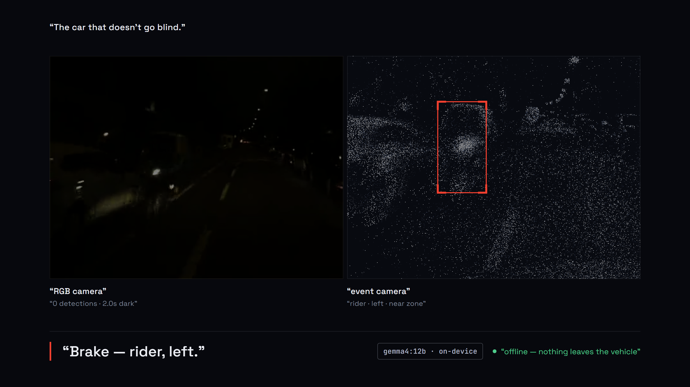
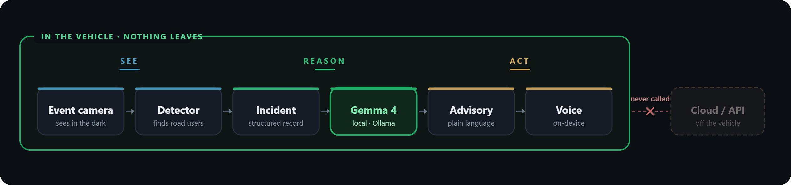
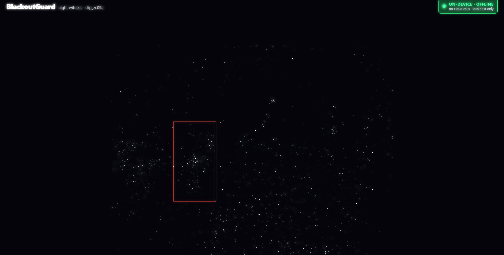

<div align="center">

# BlackoutGuard

**It sees the person your headlights can't — and reasons about it on-device, with the network unplugged.**

Proud submission to the **Google DeepMind Gemma Edge** on-device track

**Team BlackoutGuard**<br>
Mohamad Yazan Sadoun · University of Oklahoma, INQUIRE Lab<br>
Abdullah Osman · University of Istanbul

</div>



<div align="center">


**60-second demo:** _link added when the cut is uploaded._

</div>

---

**The problem.** Cars with pedestrian-detecting automatic braking have about 27% fewer pedestrian crashes, but a 2022 IIHS study found no measurable benefit at night on roads without streetlights ([IIHS, Cicchino 2022](https://www.iihs.org/topics/pedestrians-and-bicyclists)). That is the exact moment headlights and a normal camera give out.

**The move.** An event camera keeps seeing through that blackout — it reports per-pixel brightness changes, not exposed frames. On the vehicle's own compute, Gemma 4 reads each near-miss and turns it into a spoken driver warning.

**The proof.** Pull the network cable on camera and nothing stops: the event camera still sees, Gemma still reasons, the voice still warns. Real recorded DSEC night data, nothing leaves the vehicle.

## How it sees when you can't

The frame at the top is one instant from `clip_zc09a`: on the left, the RGB camera at luma 18 — effectively blind; on the right, the event camera seeing the same street with the detector boxing the road users. That detection becomes a structured incident, Gemma turns it into an advisory, and the voice speaks it. Every step runs on the device, in three moves: see, reason, act.



Here is the event stream itself, rendered on the device — each point is a brightness change a normal camera missed, the red box a road user tracked in the dark:



## Run it

Prerequisites: [Ollama](https://ollama.com), Node.js 18+ (`npm`), Python 3.10+.

```
ollama pull gemma4:12b     # one-time, needs network; the local reasoning model
bash run_demo.sh           # Windows: powershell -File run_demo.ps1
```

`run_demo.sh` starts Ollama and warms `gemma4:12b` locally, starts the situational-agent server, installs and serves the app, and opens it. When all three are up it prints `ALL LOCAL — SAFE TO UNPLUG`. Open the app at **http://localhost:5173** — a split screen (RGB-blind left, event-camera detections right), an advisory banner that escalates by severity, a blindness timer, an on-device/offline badge, and an operator console (ask a question, Override, Dismiss).

Prove the offline claim without a live cut:

```
bash voice/check_offline.sh          # Windows: powershell -File voice/check_offline.ps1
```

It generates the advisory from local Gemma, resolves the cached voice line, and confirms Ollama is bound to loopback only — no external network. On a machine with network-admin rights, `check_offline.ps1 -Drop` (or `check_offline.sh`) physically disables the adapter for the real cable-pull and restores it afterward.

On a laptop or edge device, set `GEMMA_MODEL=gemma4:e4b-it-qat` — the same agent runs on the smaller on-device tier.

## Tools & data (disclosed) vs built during the event

| Category | What | Note |
|---|---|---|
| Tools — pre-existing, disclosed | Public RVT detector weights · open DSEC/PEDRo night event data · **Gemma 4 open weights** (`gemma4:12b`, `gemma4:e4b-it-qat`) · Ollama runtime · Piper TTS + faster-whisper STT · React/Vite/TypeScript, Python stdlib | Our sensor front-end and local LLM/voice runtimes — disclosed like PyTorch, not our submission. |
| Built during the event — our submission | Canonical [incident schema](contracts/incident_schema.json) · situational agent ([`agent/situational.py`](agent/situational.py): local-Gemma advisories, incident-log Q&A, override feedback) · split-screen operator app ([`app/`](app/)) · agent HTTP server + app integration · voice interface, one-command launcher, and offline-proof scripts · the demo video | Fresh public repo; every commit inside the RAISE Summit event window (`git log` is the proof). |

Baked detections are precomputed by our RVT-based detector — a disclosed tool run on open DSEC night data — and copied in as the incident fixture the demo replays ([`contracts/fixtures/clip_zc09a.json`](contracts/fixtures/clip_zc09a.json)): real recorded event-camera sensor data with the detector's real per-frame output. They are disclosed input data, not perception built during the event; the schema, agent, app, integration, and video are what we built.

## How we used Gemma (locally, offline)

Gemma 4 is the reasoning engine, served locally through Ollama (`gemma4:12b`) on the vehicle's own compute — no cloud, no API keys, `http://localhost:11434` only. It does three things over the [incident schema](contracts/incident_schema.json):

- **Advisory.** For each `caution`/`brake` incident, the agent hands Gemma the derived facts (class, side, proximity, confidence, how long the RGB camera has been blind) and Gemma writes one terse spoken warning — e.g. `Brake — rider in near zone, left side.` The fixture ships that field as `null`; Gemma fills it. The first time an incident is seen Gemma generates the line and the agent caches it ([`agent/cache/`](agent/cache)), so replay serves the same line deterministically with the network unplugged.
- **Operator Q&A (live).** The operator asks in natural language ("how many times was I blinded near a pedestrian tonight?"); `POST /ask` sends the incident-log digest to Gemma and returns the answer. This is a live local Gemma call each time — no cache — and it works with the network physically down because the model runs on the device.
- **Override feedback.** When the operator dismisses a low-confidence call, the agent tells Gemma to downgrade the next similar advisory ("Note … low confidence") instead of repeating the caution.

If Ollama is unreachable and there is no cached line, the agent returns an error and the app shows a placeholder — it never fabricates an advisory. The spoken audio is a pre-rendered Piper voice line cached per incident ([`voice/cache/`](voice/cache)); it plays with no synthesis and no network.

## Limitations

- **The staged clips are darkness, not glare.** The recorded event-vs-RGB clips are the night-darkness case (open DSEC/PEDRo data): the RGB frame is dark, the event camera still sees. Headlight glare is a different failure mode — we show it only with the live Glare Box (a flashlight whiting out a live webcam while the event view keeps tracking), never by relabeling a dark clip as glare.
- **Detector recall is not perfect.** The RVT detector is a disclosed pretrained tool; on night event data it misses some objects and mislabels others. We do not claim complete detection — the boxes shown are the detector's real output on the fixture, and a miss is a miss.
- **This is a demo, not a shipped ADAS.** Single curated clip, replayed incidents, one voice on a laptop-class box standing in for in-vehicle compute. The pieces are real and run offline; a production system needs a live event-camera front end, calibration, and validation we did not do in a weekend.

## License

MIT — see [LICENSE](LICENSE).
